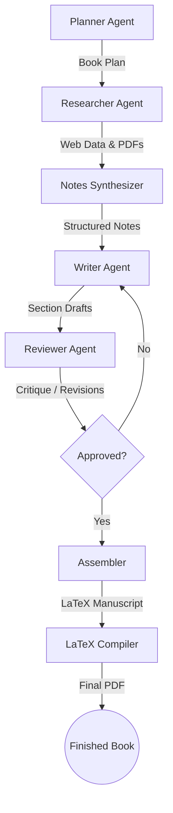

# WriterLM

WriterLM is an AI-driven, multi-agent pipeline designed to automate the process of researching, drafting, reviewing, and assembling long-form documents and books. It features a robust generation pipeline spanning from initial planning to LaTeX compilation, accompanied by a modern web studio for seamless workflow management.


## Architecture

WriterLM's architecture revolves around a robust, multi-stage LangGraph workflow. The system is designed to allow each specialized AI agent to perform its role efficiently while passing structured state data to the next stage.

### Pipeline Flow



The system is built as a multi-agent pipeline, where each agent specializes in a distinct phase of the writing process:

1. **Planner Agent** (`planner_agent/`): Generates a comprehensive book outline, structuring chapters and sections based on the user's topic, target audience, tone, and goals.
2. **Researcher** (`researcher/`): Gathers detailed information for each section. It supports **hybrid research**, dynamically pulling data from web searches (via Tavily/Firecrawl) and local, user-provided PDFs.
3. **Notes Synthesizer** (`notes_synthesizer/`): Condenses raw, disparate research material into structured, coherent notes ready for drafting.
4. **Writer** (`writer/`): Drafts the actual content section by section, utilizing the synthesized notes to ensure accuracy and depth.
5. **Reviewer** (`reviewer/`): Critiques and revises the drafts to guarantee quality, stylistic consistency, and strict alignment with the book plan.
6. **Assembler** (`assembler/`): Combines the approved drafts into a unified, properly formatted LaTeX manuscript and optionally compiles it into a final PDF.

## Web Studio


WriterLM includes a full-stack web studio allowing users to interact with and manage the writing pipelines:
- **Frontend** (`web/frontend/`): Built with Vite, providing an intuitive React-based user interface for managing book projects, tracking progress, and securely configuring provider API keys.
- **Backend** (`web/backend/`): A FastAPI application serving as the robust API for the pipeline, featuring encrypted at-rest storage for user provider keys and secure authentication using Clerk.

## Tech Stack

- **Pipeline Core**: Python 3.11+, LangGraph, SQLAlchemy, PyMuPDF, Trafilatura
- **LLMs**: Google Gemini, Groq, OpenAI (configurable per pipeline layer)
- **Frontend**: Vite, React/Next.js, Clerk (Authentication)
- **Infrastructure**: Docker, Docker Compose, PostgreSQL

## Getting Started

### Prerequisites

- Docker and Docker Compose
- Python 3.11+ (if running the pipeline locally without Docker)
- **API Keys**: 
  - Auth: Clerk Publishable and Secret Keys
  - Database: PostgreSQL (e.g., Neon)
  - *Note: LLM provider keys (Google, Groq) and Search API keys (Tavily, Firecrawl) can be managed by individual users directly within the web UI.*

### Setup

1. **Clone the repository:**
   ```bash
   git clone <repository-url>
   cd writerLm
   ```

2. **Environment Variables:**
   Copy the example environment file and configure your keys:
   ```bash
   cp .env.example .env
   ```
   Update `.env` with your `CLERK_SECRET_KEY`, `VITE_CLERK_PUBLISHABLE_KEY`, `DATABASE_URL`, and generate an `APP_ENCRYPTION_KEY` (used to encrypt user API keys in the database).

### Running with Docker Compose

The easiest and recommended way to run the full WriterLM Studio (Frontend + Backend) is via Docker Compose:

```bash
docker-compose up --build
```

- **Frontend Studio**: [http://localhost:8080](http://localhost:8080)
- **Backend API**: [http://localhost:8000](http://localhost:8000)

### Running the Pipeline Manually (CLI)

If you prefer to run the pipeline directly from the command line without the web studio:

1. Install dependencies:
   ```bash
   pip install -r requirements.txt
   ```
2. (Optional) Place any PDFs for local context research in `inputs/pdfs/`.
3. Set your required provider keys in your environment (e.g., `export TAVILY_API_KEY="..."`, `export GOOGLE_API_KEY="..."`).
4. Run the full orchestration script:
   ```bash
   python orchestration/run_full_pipeline.py
   ```
   
*Note: The `orchestration/` directory contains numerous scripts to run individual pipeline layers in isolation (e.g., `run_research_only.py`, `run_latex_compile.py`, `run_assembler_only.py`).*

## Environment Configuration

Key environment variables in `.env` for the pipeline:
- `LLM_PROVIDER`: Default LLM provider (e.g., `google`, `groq`).
- `*_GOOGLE_MODEL` / `*_GROQ_MODEL`: Configure specific models for each pipeline stage (planner, researcher, notes, writer, reviewer).
- `WRITERLM_COMPILE_LATEX`: Set to `1` to automatically compile the generated LaTeX manuscript to PDF.
- `WRITERLM_FORCE_WEB_RESEARCH`: Set to `1` to force web research even if local PDFs are provided in the inputs directory.
