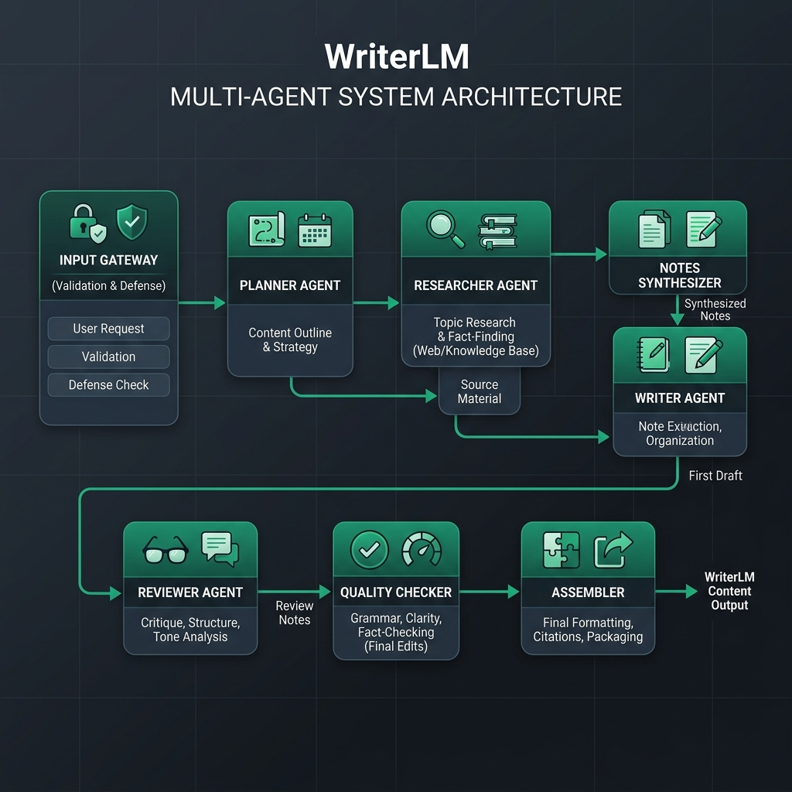

# WriterLM

WriterLM is an advanced, AI-driven multi-agent system designed to automate the process of researching, drafting, reviewing, and assembling long-form documents and textbooks. The platform features a robust generation pipeline powered by LangGraph, seamlessly accompanied by a modern web studio for user and workflow management.



## Overview

At its core, WriterLM orchestrates a multi-stage workflow where highly specialized AI agents execute distinct phases of the writing process. By separating concerns, WriterLM ensures high-quality, deeply researched, and stylistically consistent output.

### The Agent Pipeline

1. **Input Gateway**: Sanitizes and normalizes the user prompt. It defends against prompt injections, implements robust parsing with fallback mechanisms, and ensures the pipeline starts with a secure and structured book request.
2. **Planner Agent** (`planner_agent/`): Initializes the book structure. Based on user inputs (topic, target audience, tone, and goals), the planner outlines chapters, sections, and the overarching instructional logic.
3. **Researcher** (`researcher/`): Conducts thorough data gathering. It supports a **hybrid research mode**, dynamically crawling the web (via Tavily/Firecrawl) or extracting data from user-uploaded PDFs to build context for each section.
4. **Notes Synthesizer** (`notes_synthesizer/`): Processes raw research packets, condensing them into structured, coherent notes formatted perfectly for drafting.
5. **Writer** (`writer/`): Generates the actual content section-by-section, leveraging the synthesized notes to maintain factual accuracy and narrative flow.
6. **Reviewer** (`reviewer/`): Analyzes the generated drafts, offering critiques and requesting revisions until the content aligns perfectly with the book plan and stylistic guidelines.
7. **Quality Checker** (`quality/`): Runs an automated Quality Assurance (QA) pass on the approved drafts. It derives a "book contract" from the initial constraints and executes a repair loop with targeted validators to ensure factual accuracy and structural adherence.
8. **Assembler** (`assembler/`): Combines all approved and QA-verified section drafts into a cohesive LaTeX manuscript, compiling it into a polished, final PDF.


## Tech Stack

- **Core AI Pipeline**: Python 3.11+, LangGraph, PyMuPDF, Trafilatura
- **Backend / Orchestration**: FastAPI, SQLAlchemy, PostgreSQL
- **Frontend / Studio**: Vite, React, Clerk (Authentication)
- **Infrastructure**: Docker, Docker Compose
- **LLM Integrations**: Flexible provider support (Google Gemini, Groq, OpenAI) tailored per pipeline stage.

---

## Contributor Setup Guide

Whether you're developing new pipeline features or expanding the Web Studio, here is how you can set up WriterLM for local development.

### Prerequisites

- **Docker & Docker Compose** (Recommended for full stack)
- **Python 3.11+** (If running the Python pipeline locally without Docker)
- **Node.js 20+** (If running the frontend locally)
- A **Clerk Account** (for Auth) and a **PostgreSQL** database (e.g., Neon or local).

### 1. Environment Configuration

Clone the repository and set up your environment variables:

```bash
git clone https://github.com/anounman/WriterLm.git
cd writerLm
cp .env.example .env
```

Configure your `.env` file with your specific credentials:
- `VITE_CLERK_PUBLISHABLE_KEY` and `CLERK_SECRET_KEY`
- `DATABASE_URL`
- `APP_ENCRYPTION_KEY`: A Fernet key used to encrypt user API keys in the database. Generate one using: 
  ```bash
  python -c "from cryptography.fernet import Fernet; print(Fernet.generate_key().decode())"
  ```

*(Note: API keys for LLMs like Google, Groq, and Search APIs like Tavily or Firecrawl can be configured securely by users through the Studio's UI.)*

### 2. Running the Full Stack (Docker Compose)

The easiest way to get the entire application running—frontend, backend, and the background workers—is via Docker.

```bash
docker-compose up --build
```

- **Frontend Studio**: [http://localhost:8080](http://localhost:8080)
- **Backend API**: [http://localhost:8000](http://localhost:8000)

### 3. Local Development (Without Docker)

If you are iterating heavily on the AI pipeline or backend, you may want to run them natively.

**Backend/Pipeline Setup:**
```bash
python -m venv venv
source venv/bin/activate
pip install -r requirements.txt
```

To run the orchestration pipeline via CLI (bypassing the web backend):
```bash
# Ensure your API keys (GOOGLE_API_KEY, TAVILY_API_KEY) are in your shell
python orchestration/run_full_pipeline.py
```
*(Drop PDFs into `inputs/pdfs/` to utilize the local document research features.)*

**Frontend Setup:**
```bash
cd web/frontend
npm install
npm run dev
```

## Contributing

We welcome contributions! When adding new capabilities to an agent, please test your changes in isolation using the specific scripts in the `orchestration/` directory (e.g., `run_research_only.py`, `run_assembler_only.py`) before integrating them into the main pipeline. Ensure all new components respect the typed inputs and outputs defined by the LangGraph states.
